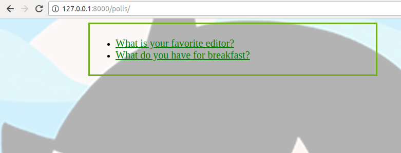
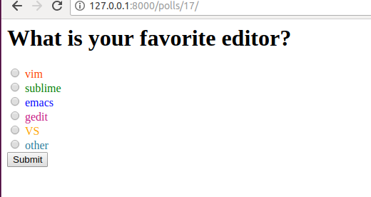
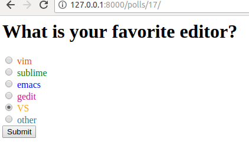
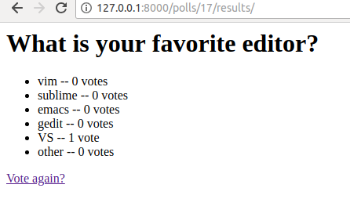

Screens
=======
1) Polls screen

2) Poll-choice screen

3) Choice screen

4) Result screen



Set Up
======
These set up instructions assume that the user's operating system is either Mac OS X or Linux. To run this project, download and install the latest version of [python3](https://www.python.org/downloads/). Next, download and [install virtualenv](https://virtualenv.pypa.io/en/latest/installation.html):

```
pip3 install virtualenv
```

Create a python3 virtual environment:

```
virtualenv <virtual environment directory> -p python3
```

It is recommended that you choose a virtual environment directory outside of this project's directory so that you do not accidentally commit it to the git repository.

Activate your virtual environment:

```
source <virtual environment directory>/bin/activate
```

(Note: to deactivate your virtual environment, simply use the `deactivate` command.)

Install the python dependencies required to run this project to your virtual environment:

```
cd <project root directory>
pip install -r requirements.txt
```

(Project root directory refers to the directory this file is found in.)

This project is a git repository, so you should also download and install [git](https://git-scm.com/downloads).

Feature of the project
================================

As a poll administrator, when I create a Choice for a Question, I need to choose what color the Choice will appear as to the users who vote on them. I must be able to specify any valid web color in hex triplet format (https://en.wikipedia.org/wiki/Web_colors#Hex_triplet). Whenever a voter views a Choice, its font-color should be the color that I specified. I will be able to specify a different color for each Choice, but Choice colors don't need to be unique.


